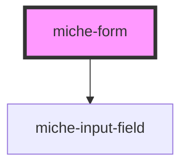

# miche-form

<!-- Auto Generated Below -->

## Properties

| Property           | Attribute            | Description | Type      | Default          |
| ------------------ | -------------------- | ----------- | --------- | ---------------- |
| `isOnModal`        | `is-on-modal`        |             | `boolean` | `false`          |
| `isOnPricingPage`  | `is-on-pricing-page` |             | `boolean` | `false`          |
| `isOverlayVisible` | `is-overlay-visible` |             | `boolean` | `false`          |
| `submitUrl`        | `submit-url`         |             | `string`  | `''`             |
| `variant`          | `variant`            |             | `string`  | `'bookDemoForm'` |

## Events

| Event               | Description | Type                  |
| ------------------- | ----------- | --------------------- |
| `closeOverlay`      |             | `CustomEvent<any>`    |
| `eraseInput`        |             | `CustomEvent<Object>` |
| `showModal`         |             | `CustomEvent<any>`    |
| `toggleOffSnackbar` |             | `CustomEvent<any>`    |

## Dependencies

### Depends on

- [miche-input-field](../input)

### Graph

----------------------------------------------

*Built with [StencilJS](https://stenciljs.com/)*
