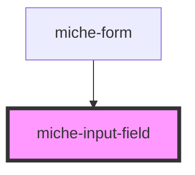

# miche-input-field

<!-- Auto Generated Below -->

## Properties

| Property     | Attribute     | Description | Type     | Default     |
| ------------ | ------------- | ----------- | -------- | ----------- |
| `ariaLabel`  | `aria-label`  |             | `string` | `undefined` |
| `helperText` | `helper-text` |             | `string` | `undefined` |
| `idprop`     | `idprop`      |             | `string` | `undefined` |
| `label`      | `label`       |             | `string` | `undefined` |
| `maxlength`  | `maxlength`   |             | `string` | `undefined` |
| `minlength`  | `minlength`   |             | `string` | `undefined` |
| `name`       | `name`        |             | `string` | `undefined` |
| `options`    | --            |             | `any[]`  | `undefined` |
| `regex`      | --            |             | `RegExp` | `undefined` |
| `type`       | `type`        |             | `string` | `undefined` |

## Events

| Event       | Description | Type                  |
| ----------- | ----------- | --------------------- |
| `saveInput` |             | `CustomEvent<Object>` |

## Dependencies

### Used by

 - [miche-form](../form)

### Graph

----------------------------------------------

*Built with [StencilJS](https://stenciljs.com/)*
